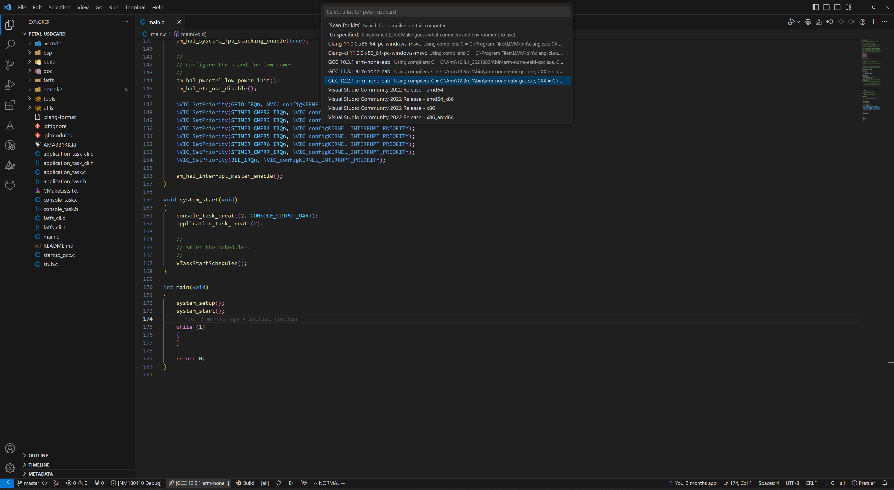
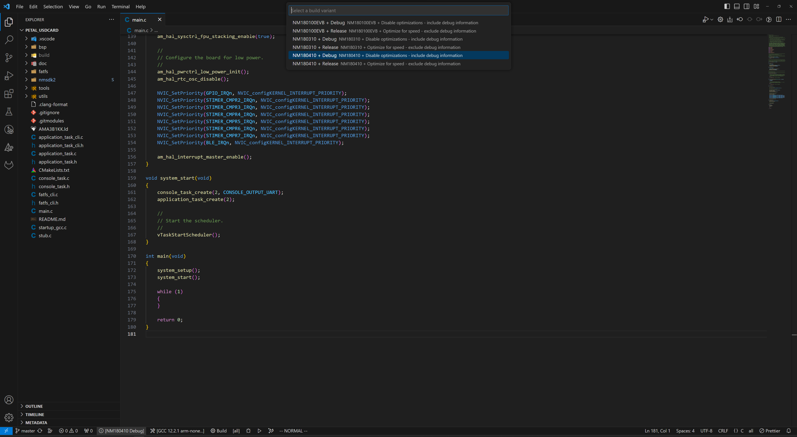
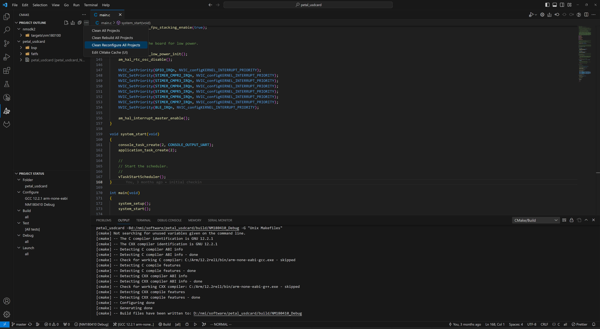
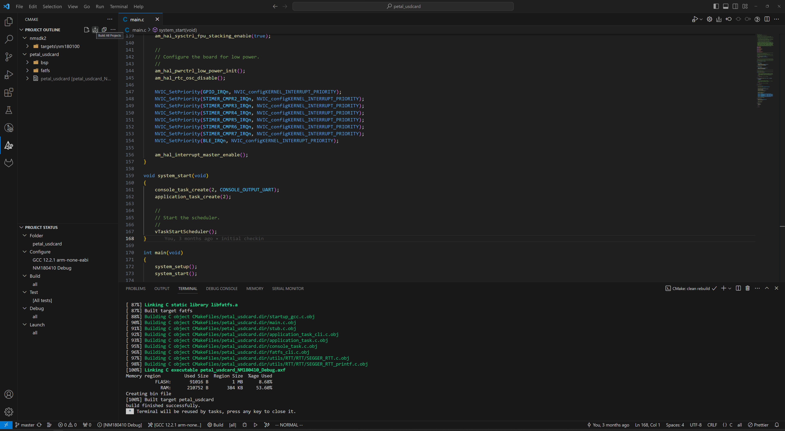
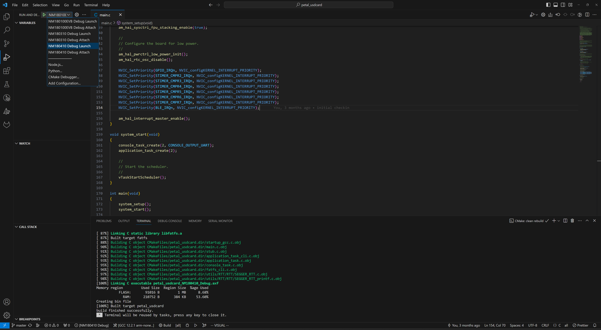
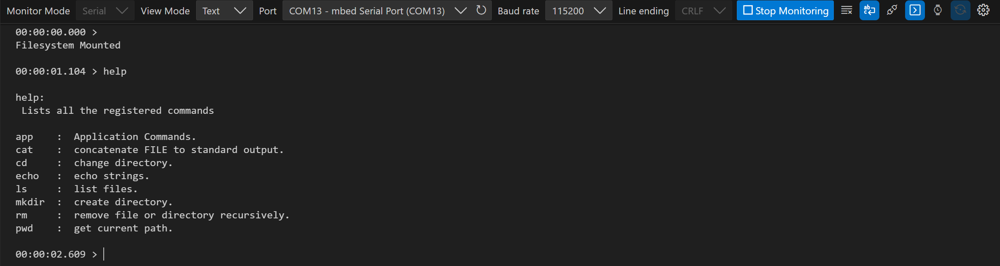

# Petal Development Board SD Card Demo

## Introduction

This application demonstrates the usage of the on-board micro SD card of the Petal
Development Board.

## Requirements

### Hardware

- A Petal Development Board
- A Petal Core Board
- A USB C cable
- A Linux or Windows machine
- A micro SD card

### Software

- ARM GNU Toolchain Compiler
- pyOCD
- make
- cmake
- Python
- Visual Studio Code

## Quick Start

1. Select the compiler version for your system as shown in the screenshot. If
   none appears in the list, try the `Scan for Kits` option or follow the
   <a href="https://github.com/NorthernMechatronics/nmapp2/blob/master/doc/getting_started.md">
   Getting Started</a> guide in nmapp2 to ensure that
   the ARM compiler is installed properly.
   

2. Select NM180410 Debug or Release as the build variant.
   

3. Click the CMAKE extension icon in the Activity Bar on the left and
   in the primary sidebar, move your mouse cursor to Project Outline and click More
   Actions (denoted by the three dots ...) to expand the menu. Click on
   `Clean Reconfigure All Projects`.
   

4. Once the configuration process is completed, click on the Build All Projects
   icon in Project Outline. For a clean re-build, you can also select
   `Clean Rebuild All Projects`
   

5. Once the build is completed, click on Run and Debug in the Activity Bar on the left and
   select NM180410 Debug or Release as the run variant.
   

6. Click the play button to load and run the program. Once the board is booted, you should
   see the following in a serial terminal.
   

## SD Card

If an SD Card is already inserted, the file system will be mounted on start up. The SD Card
can be inserted or removed anytime. An interrupt is generated by the nDET line anytime an SD
Card is inserted or removed which will mount and unmount the file system automatically.

The default supported formats are FAT and exFAT; 16kB allocation size. If you get a disk error,
re-format the SD card with one of the supported format.

## Serial Console Interaction

You can interact with the hardware using a serial connection. In this
example, we will use the Microsoft Serial Monitor extension for VS Code but
you can use any other terminal programs such as Putty or minicom to name a few.

To show a list of supported commands, type `help` at the prompt. Supported commands are

| Command                | Description                                                                         | Example                              |
| ---------------------- | ----------------------------------------------------------------------------------- | ------------------------------------ |
| cat [file]             | Reads and prints data from a text file                                              | `cat file_name.txt`                  |
| cd [directory]         | Changes the current working directory into directory                                | `cd directory`                       |
| echo "string" > [file] | Writes string into a file. Appends if the file already exists.                      | `echo "Hello World" > file_name.txt` |
| ls <directory>         | lists the content in directory or the current directory if no argument is specified | `ls`                                 |
| mkdir [directory]      | Creates directory                                                                   | `mkdir directory`                    |
| rm [directory\|file]   | Deletes a file or a directory recursively                                           | `rm file_name.txt`                   |
| pwd                    | Prints the current working directory                                                | `pwd`                                |
